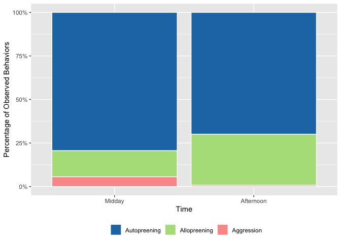
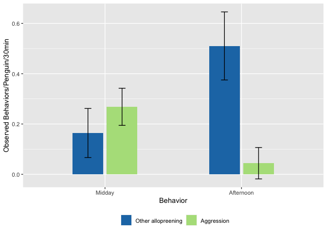

Penguins
================

## Penguin Behavioral Study

This markdown document is a summary of the penguin behavioral study that
I took on earlier this semester. I observed an African penguin enclosure
via live-stream (Georgia Aquarium) for four days. Data collection
occurred for thirty minutes in the midday and thirty minutes in the
afternoon each day. The behaviors noted were: autopreening,
allopreening, courtship/mating, and aggression. This study investigated
the hypothesis that more allopreening behavior would lead to less
aggressive behavior among the group of penguins.

## Ethogram

Description of penguin behaviors observed:

| Behavior         | Description                                                                                                                                          |
|:-----------------|:-----------------------------------------------------------------------------------------------------------------------------------------------------|
| Autopreening     | The penguin is self-preening by licking and/or picking at their own feathers and skin.                                                               |
| Allopreening     | The penguin is licking and/or picking at the feathers and skin of another penguin to help clean or to engage in social connections.                  |
| Mating/Courtship | The penguins are braying (loud donkey-like mating call) and flapping flippers in unison; animals are attempting to mount another or be mounted onto. |
| Aggression       | The penguin is biting and/or lunging at others.                                                                                                      |

## Results

These plots show some of the results from the study. Mating/Courtship
was removed because the amount of observations were negligible. Plot 2
supports the hypothesis because when there was a greater allopreening
rate in the afternoon, there was less aggression when compared to the
midday observations.

<!-- --><!-- -->
